# Spiegazione Completa del Codice in `src`

Questa guida ti spiega passo passo cosa fanno tutti i moduli nella directory `src` del progetto RHOSTS, utilizzando come riferimento la documentazione esistente in `Docs`.

---

## 📋 Panoramica Generale

Il codice in `src` è organizzato in due macro-aree:

1. **`src/preprocessing`** - Pre-processamento dati fMRI HCP
2. **`src/higher_order`** - Pipeline completa per l'analisi higher-order

### Struttura Directory `src`

```
src/
├── preprocessing/
│   ├── preprocessing.sh
│   └── preprocessing_hcp.py
└── higher_order/
    ├── __init__.py
    ├── orchestration/       # Entry point e coordinamento
    │   ├── main.py
    │   ├── main.sh
    │   ├── launch_wrapper.sh
    │   └── group.sh
    ├── nodal_strength/      # Calcolo nodal strength
    │   ├── pipeline.py
    │   ├── loaders_dv.py
    │   ├── loaders_scaffold.py
    │   └── utils.py
    └── visualization/       # Generazione brain maps
        ├── utils_neuromaps_brain.py
        └── utils_nilearn_brain.py
```

### Modalità di Analisi

**Due modalità principali (mutualmente esclusive):**

1. **DV (Dynamic Violations)**: Analizza triangoli violanti Δv
   - Input: file HDF5 con edge_weights da triangoli violanti
   - Calcola nodal strength proiettando triangoli → archi → nodi
   - Tipicamente usato con `--metric coherence` (top 15% frame più coerenti)

2. **Scaffold (Homological Scaffold)**: Analizza cicli persistenti H₁
   - Input: directory con file `.pck` contenenti generatori omologici
   - Calcola nodal strength da grafo pesato dei cicli persistenti
   - Tipicamente usato con `--metric complexity --direction low` (bottom 15% frame meno complessi)

**Mode GROUP (opzionale):**
- NON è una modalità di analisi parallela a DV/scaffold
- È un passo POST-processing per aggregare risultati `.npy` pre-calcolati
- Utile per combinare analisi fatte in tempi diversi o da sottogruppi

**IMPORTANTE**: Come descritto nel paper (Santoro et al., Nature Physics 2023), i risultati sono:
> "averaged over all 100 HCP subjects and scans"

Questo significa che **mode DV e scaffold fanno GIÀ la media over subjects AND over timepoints** in un singolo passaggio. NON serve un workflow in due fasi.

---

## 🔬 Parte 1: Preprocessing (`src/preprocessing`)

### `preprocessing_hcp.py`

**Obiettivo**: Estrarre time series ROI-averaged da dati fMRI 4D utilizzando atlanti cerebrali.

#### Input
- **fMRI data**: File `.nii.gz` 4D con shape `(X, Y, Z, T)`
  - X, Y, Z: dimensioni spaziali
  - T: timepoints
- **Atlanti**:
  - Corticale: `cortex_100.nii.gz` (100 ROI)
  - Sottocorticale: `subcortex_16.nii` (16 ROI)

#### Funzioni Principali

##### `compute_roi_timeseries(fmri_data, atlas_data, n_rois)`

**Cosa fa**:
1. Per ogni ROI (identificata da un valore intero nell'atlante):
   - Crea una maschera booleana `(X, Y, Z)` per identificare i voxel di quella ROI
   - Estrae i voxel fMRI corrispondenti
   - Calcola la **media** dei voxel nel tempo → ottiene una time series `(T,)` per quella ROI
2. Restituisce una matrice `(T, n_rois)` dove ogni colonna è la time series di una ROI

**Esempio**:
```python
# Se hai 1200 timepoints e 100 ROI corticali:
# fmri_data.shape = (91, 109, 91, 1200)  # esempio di dimensioni fMRI
# atlas_data.shape = (91, 109, 91)       # atlante 3D
# Output: ts.shape = (1200, 100)
```

##### `main()`

**Pipeline completa**:
1. Definisce i subject ID da processare
2. Carica gli atlanti (corticale e sottocorticale)
3. Per ogni soggetto:
   - Carica i dati fMRI 4D
   - Estrae time series corticali `(T × 100)`
   - Estrae time series sottocorticali `(T × 16)`
   - **Concatena** → `(T × 116)` ROI totali
   - Applica **z-score normalization** colonna per colonna (per ROI)
   - Salva come file `.txt`

#### Output
File di testo con time series z-scored:
- Shape: `(T, 116)` dove T = numero di timepoints
- Ogni colonna = una ROI normalizzata

---

## 🧠 Parte 2: Higher-Order Analysis (`src/higher_order`)

Questa è la parte principale del codice che implementa l'analisi higher-order descritta nel paper di Santoro et al.

### Architettura a 3 Livelli


---

## 📦 Modulo: `orchestration`

### `main.py` - Entry Point CLI

**Ruolo**: Punto di ingresso command-line per tutta la pipeline.

#### Funzione `parse_args()`

Definisce gli argomenti CLI:

| Argomento | Tipo | Descrizione |
|-----------|------|-------------|
| `--mode` | `dv`, `scaffold`, `group` | Modalità di analisi |
| `--inputs` | lista | File HDF5 (dv), directory scaffold, o file .npy (group) |
| `--scenario` | `single_frame`, `all_frames`, `top_percent` | Strategia di selezione frame |
| `--frame` | int | Frame specifico (per single_frame) |
| `--percent` | float | Percentuale frame (default 0.15 = 15%) |
| `--sorted-output-txt` | str | File con indicatori ordinati |
| `--num-rois` | int | Numero ROI (default 116) |
| `--metric` | `coherence`, `complexity` | Metrica per top_percent |
| `--output-npy` | str | Path output array numpy |
| `--output-img` | str | Path output immagine (opzionale) |

#### Funzione `main()`

**Pipeline completa**:

1. **Parsing argomenti** e traduzione metrica:
   - `coherence` → colonna 5 (hyper-coherence), ordine decrescente (high values)
   - `complexity` → colonna 1 (hyper-complexity), ordine crescente (low values)

2. **Dispatch basato su mode**:

   **Mode = `group`**:
   - Carica tutti i file `.npy` in input
   - Calcola la **media** tra soggetti → `nodal_strength`
   
   **Mode = `dv`** (Dynamic Violations):
   - Chiama `compute_brainmap_dv()` da `pipeline.py`
   - Input: file HDF5 con triangoli violanti
   
   **Mode = `scaffold`**:
   - Chiama `compute_brainmap_scaffold()` da `pipeline.py`
   - Input: directory con file `.pck` contenenti generatori H₁

3. **Salvataggio risultati**:
   - Salva array numpy con `np.save(args.output_npy, nodal)`

4. **Generazione immagine** (se `--output-img` specificato):
   - Controlla disponibilità DISPLAY (X server)
   - Se disponibile: usa `normal_view()` da `utils_neuromaps_brain.py`
   - Altrimenti: fallback a `nilearn_view()` da `utils_nilearn_brain.py`
   - Salva figura come PNG (300 dpi)

### Script Bash: `main.sh`, `launch_wrapper.sh`, `group.sh`

Questi script orchestrano l'esecuzione su SLURM (vedere documentazione workflow).

---

## 🔢 Modulo: `nodal_strength`

### `pipeline.py` - Orchestrazione High-Level

Contiene le due funzioni principali per computare brain maps.

#### `compute_brainmap_dv()`

**Obiettivo**: Calcolare nodal strength dai **violating triangles** (modalità DV).

**Parametri**:
- `hd5_paths`: lista di file HDF5 contenenti edge_weights
- `scenario`: `single_frame`, `all_frames`, `top_percent`
- `metric`: `"hyper"` (coherence) o `"complexity"`
- `direction`: `"high"` (top %) o `"low"` (bottom %)

**Pipeline**:
1. Traduce `metric` e `direction` in:
   - `value_col`: colonna da usare nel file sorted
   - `order`: `"desc"` o `"asc"`
2. Chiama `select_frames()` per determinare quali frame analizzare
3. Chiama `aggregate_frames()` con `load_single_frame_dv` come loader
4. Restituisce vettore nodal strength `(num_ROIs,)`

#### `compute_brainmap_scaffold()`

**Obiettivo**: Calcolare nodal strength dall'**homological scaffold** (modalità scaffold).

**Differenze rispetto a DV**:
- Input: directory con file `generators__*.pck`
- Usa `load_single_frame_scaffold` come loader
- Default: `metric="complexity"`, `direction="low"` (bottom 15% = frame meno complessi)

**Pipeline**: Identica a `compute_brainmap_dv()` ma con loader diverso.

---

### `utils.py` - Frame Selection & Aggregation

Utility condivise per entrambe le modalità (DV e scaffold).

#### `select_frames()`

**Obiettivo**: Selezionare quali frame temporali analizzare.

**3 Scenari possibili**:

##### 1. `scenario = "single_frame"`
- Restituisce `[frame]` (il frame specificato)

##### 2. `scenario = "all_frames"`
- **DV mode**: apre primo file HDF5, legge tutte le chiavi → frame disponibili
- **Scaffold mode**: scannerizza directory cercando file `generators__*.pck`, estrae i numeri dai nomi
- Restituisce lista completa di frame

##### 3. `scenario = "top_percent"`
- Legge file `sorted_output_txt` con indicatori
- Estrae colonna `value_col` (es. colonna 5 = hyper-coherence)
- Ordina secondo `order`:
  - `"desc"`: prende top N% (valori più alti)
  - `"asc"`: prende bottom N% (valori più bassi)
- Calcola `n_top = ceil(len(timepoints) * percent)`
- Restituisce frame corrispondenti

**Esempio**:
```python
# Per prendere il 15% di frame più coerenti:
frames = select_frames(
    hd5_files=[...],
    scenario="top_percent",
    percent=0.15,
    sorted_output_txt="indicators.txt",
    value_col=5,      # hyper-coherence
    order="desc"      # valori alti
)
```

#### `aggregate_frames()`

**Obiettivo**: Caricare e mediare nodal strength attraverso soggetti e frame.

**Parametri**:
- `hd5_files`: lista file/directory (uno per soggetto)
- `frames`: lista frame da caricare
- `loader_fn`: funzione di caricamento (DV o scaffold)
- `num_ROIs`: numero ROI attese

**Pipeline**:
1. Ciclo doppio: per ogni soggetto, per ogni frame
2. Chiama `loader_fn(file, frame, num_ROIs)` → ottiene vettore `(num_ROIs,)`
3. Accumula in `total` e incrementa `count`
4. Gestisce errori con `warnings` (skip se file mancante o lunghezza errata)
5. Restituisce `total / count` → **media** nodal strength

---

### `loaders_dv.py` - Caricamento Dynamic Violations

#### `load_single_frame_dv(hd5_file, frame, num_ROIs)`

**Obiettivo**: Caricare un frame da file HDF5 e calcolare nodal strength.

**Struttura HDF5 DV**:
```
file.hdf5
├── "0"     → dataset per frame 0
├── "1"     → dataset per frame 1
├── ...
└── "1199"  → dataset per frame 1199

Ogni dataset ha shape (N_edges, 4):
  colonna 0: nodo i
  colonna 1: nodo j
  colonna 2: sum_w (somma pesi triangoli violanti contenenti (i,j))
  colonna 3: count (numero triangoli violanti contenenti (i,j))
```

**Pipeline**:
1. Apre file HDF5
2. Legge dataset `str(frame)`
3. Passa dati a `compute_nodal_strength_dv()`

#### `compute_nodal_strength_dv(triangle_data, num_ROIs)`

**Concetto chiave**: Proiezione "downward" dai triangoli agli archi ai nodi.

**Pipeline dettagliata**:

1. **Costruzione edge_weights**:
   ```python
   for row in triangle_data:
       i, j = int(row[0]), int(row[1])
       sum_w = row[2]    # somma pesi
       count = row[3]    # numero triangoli
       edge = (i, j)
       w_ij = sum_w / count  # peso medio dell'arco
       edge_weights[edge] = w_ij
   ```

2. **Proiezione sui nodi** (calcolo nodal strength):
   ```python
   nodal_strength = np.zeros(num_ROIs)
   for (i, j), w_ij in edge_weights.items():
       nodal_strength[i] += w_ij
       nodal_strength[j] += w_ij
   ```

**Interpretazione**:
- Un arco $(i, j)$ "eredita" il peso medio dei triangoli violanti che lo contengono
- Un nodo $i$ accumula i pesi di tutti gli archi incidenti
- **Nodal strength** = quanto un nodo è coinvolto in strutture higher-order violanti

---

### `loaders_scaffold.py` - Caricamento Scaffold

#### `load_single_frame_scaffold(directory, frame, num_ROIs)`

**Obiettivo**: Caricare scaffold da file pickle e calcolare nodal strength.

**Pipeline**:
1. Chiama `load_scaffold_singletime(directory, frame)`
2. Passa grafo a `compute_nodal_strength_scaffold()`

#### `load_scaffold_singletime(directory, single_time, hom_group=1)`

**Obiettivo**: Costruire grafo pesato dai generatori H₁.

**Struttura file `.pck`**:
```python
{
    1: [cycle_1, cycle_2, ...],  # generatori H₁
    2: [...]                      # generatori H₂ (se presenti)
}
```

**Pipeline**:
1. Carica file `generators__{frame}.pck`
2. Estrae lista cicli da `gen[hom_group]` (default H₁)
3. Per ogni ciclo:
   - Calcola persistenza: `w = cycle.persistence_interval()`
   - Per ogni arco nel ciclo:
     - Se arco già presente nel grafo: `G[u][v]['weight'] += w`
     - Altrimenti: `G.add_edge(u, v, weight=w)`

**Risultato**: Grafo NetworkX pesato dove:
- **Archi** = unione di tutti gli archi nei cicli persistenti
- **Peso arco** = somma delle persistenze dei cicli che contengono quell'arco

#### `compute_nodal_strength_scaffold(G, num_ROIs)`

**Obiettivo**: Calcolare nodal strength dal grafo scaffold.

**Implementazione semplicissima**:
```python
nodal = np.zeros(num_ROIs)
for node, strength in G.degree(weight='weight'):
    if node < num_ROIs:
        nodal[node] = strength
```

**NetworkX nota**: `G.degree(weight='weight')` restituisce la **weighted node degree**, ovvero la somma dei pesi degli archi incidenti al nodo = **nodal strength**!

---

## 🎨 Modulo: `visualization`

### `utils_neuromaps_brain.py`

**Obiettivo**: Generare brain maps usando `surfplot` e `neuromaps` (richiede DISPLAY).

#### `normal_view()`

**Parametri principali**:
- `current_nodestrength`: vettore `(num_ROIs,)` con valori nodal strength
- `cmap`: colormap matplotlib
- `parcellation`: nome parcellazione (default `'schaefer'`)
- `parcellation_name`: specifica quale parcellazione (100 ROI corticali)

**Pipeline**:
1. Carica superfici cerebrali da `neuromaps`:
   ```python
   surfaces = fetch_fslr(density='32k')
   lh_mesh, rh_mesh = surfaces['inflated']
   ```

2. Carica parcellazione (mappa ROI → vertici):
   ```python
   lh, rh = load_parcellation(parcellation, scale=parcellation)
   ```

3. **Mapping ROI → vertici**:
   - Per ogni ROI, trova tutti i vertici che appartengono a quella ROI
   - Assegna il valore nodal strength a tutti quei vertici

4. Crea plot con `surfplot.Plot`:
   - Vista laterale sinistra/destra
   - Vista mediale sinistra/destra
   - Colorbar centrata
   - Sulci overlay (anatomia)

5. Restituisce figura matplotlib

#### `full_view()`

Come `normal_view()` ma con 6 viste: lateral, medial, dorsal, ventral, anterior, posterior.

#### `compose_full_view()`

Assembla le 6 viste in un'unica figura usando `svgutils`.

### `utils_nilearn_brain.py`

**Obiettivo**: Fallback per ambienti headless (senza DISPLAY).

#### `nilearn_view()`

**Differenze rispetto a neuromaps**:
- Usa `nilearn.plotting.plot_surf()` invece di `surfplot`
- Carica mesh fsLR 32k da `neuromaps` (stesso dataset)
- Mapping ROI → vertici identico
- **Vantaggio**: funziona senza X server!

**Limitazione**: Vista singola (non multipla come surfplot).

---

## 🔄 Flusso Completo End-to-End

```mermaid
graph TB
    A[Dati fMRI 4D] --> B[preprocessing_hcp.py]
    B --> C[Time Series<br/>T × 116 ROI]
    
    C --> D[Analisi Higher-Order<br/>High_order_TS o High_order_TS_with_scaffold]
    
    D --> E1[Indicators .txt<br/>hyper-coherence, complexity]
    D --> E2[DV: edge_weights .hdf5<br/>triangoli violanti]
    D --> E3[Scaffold: generators .pck<br/>cicli H₁]
    
    E1 --> F[main.py --mode dv/scaffold]
    E2 --> F
    E3 --> F
    
    F --> G[pipeline.py]
    G --> H1[loaders_dv.py]
    G --> H2[loaders_scaffold.py]
    
    H1 --> I[utils.py<br/>select_frames + aggregate_frames]
    H2 --> I
    
    I --> J[Nodal Strength<br/>vettore num_ROIs]
    
    J --> K[visualization<br/>utils_*_brain.py]
    
    K --> L[Brain Map<br/>immagine PNG]
    
    style A fill:#e3f2fd
    style C fill:#e8f5e9
    style E1 fill:#fff3e0
    style E2 fill:#fce4ec
    style E3 fill:#f3e5f5
    style J fill:#ffebee
    style L fill:#e0f2f1
```



### Esempio Pratico: Analisi DV Top 15% Coherence

**Scenario**: Analizzare top 15% frame più coerenti per 5 soggetti HCP.

```bash
# Comando SINGOLO per analisi completa
python src/higher_order/orchestration/main.py \
    --mode dv \
    --inputs \
        Output/lorenzo_data/134829/134829_edge_weight.hdf5 \
        Output/lorenzo_data/393247/393247_edge_weight.hdf5 \
        Output/lorenzo_data/745555/745555_edge_weight.hdf5 \
        Output/lorenzo_data/905147/905147_edge_weight.hdf5 \
        Output/lorenzo_data/943862/943862_edge_weight.hdf5 \
    --scenario top_percent \
    --percent 0.15 \
    --metric coherence \
    --sorted-output-txt Output/lorenzo_data/134829/134829_indicators.txt \
    --num-rois 116 \
    --output-npy Output/lorenzo_data/group_top15_coherence.npy \
    --output-img Output/lorenzo_data/group_top15_coherence.png

# Output:
#   - group_top15_coherence.npy: vettore (116,) con nodal strength 
#     MEDIATO su (5 soggetti × ~180 frame top 15%) = 900 sample
#   - group_top15_coherence.png: brain map visualizzazione
```

**Note importanti**:
- `--sorted-output-txt`: prende file di UN soggetto (es. 134829) perché la selezione frame è COMUNE a tutti i soggetti
- La selezione top 15% viene applicata UNA VOLTA, poi quegli stessi frame sono caricati per TUTTI i soggetti
- Il risultato è la media su (n_subjects × n_selected_frames) sample

### Cosa Succede Internamente (Passo per Passo):

1. **`main.py parse_args()`**:
   - `mode = "dv"`
   - `metric = "coherence"` → `internal_metric = "hyper"`, `direction = "high"`
   - `inputs` contiene 5 file HDF5

2. **`main.py main()`**:
   - Chiama `compute_brainmap_dv(..., metric="hyper", direction="high")`

3. **`pipeline.py compute_brainmap_dv()`**:
   - Traduce: `metric="hyper"` → `value_col=5`
   - Traduce: `direction="high"` → `order="desc"`
   - Chiama `select_frames(..., value_col=5, order="desc")`

4. **`utils.py select_frames()`**:
   - Legge `134829_indicators.txt`
   - Prende colonna 5 (hyper-coherence)
   - Ordina decrescente
   - Seleziona top 15% frame → es. `[100, 245, 789, ...]` (180 frame se 1200 totali)

5. **`pipeline.py` chiama `utils.py aggregate_frames()`**:
   - **Doppio loop**:
     ```python
     for subject in [134829, 393247, 745555, 905147, 943862]:  # 5 soggetti
         for frame in [100, 245, 789, ...]:  # 180 frame
             nodal = load_single_frame_dv(subject.hdf5, frame, 116)
             total += nodal  # Accumula
             count += 1      # count = 5 × 180 = 900
     return total / count    # MEDIA su 900 sample
     ```

6. **`loaders_dv.py load_single_frame_dv()`** (chiamato 900 volte):
   - Apre HDF5 del soggetto
   - Legge dataset per quel frame (es. "100")
   - Chiama `compute_nodal_strength_dv()`

7. **`loaders_dv.py compute_nodal_strength_dv()`**:
   - Per ogni edge: calcola `w_ij = sum_w / count`
   - Per ogni nodo: `nodal[i] += w_ij` per archi incidenti
   - Restituisce vettore `(116,)`

8. **`main.py`** al termine:
   - Salva `group_top15_coherence.npy` (vettore mediato)
   - Genera e salva immagine brain map

### Mode GROUP (Uso Opzionale)

### Mode GROUP (Uso Opzionale)

Mode GROUP serve per aggregare file `.npy` già calcolati. **NON è necessario per il workflow standard del paper**.

**Quando usarlo:**
- Hai calcolato nodal strength separatamente in momenti diversi
- Vuoi combinare risultati da sottogruppi (es. giovani vs anziani)
- Vuoi fare "grand average" di analisi già mediate

**Esempio**:
```bash
# Supponiamo di aver già calcolato separatamente:
# - top_coherence.npy (top 15% coherence)  
# - bottom_complexity.npy (bottom 15% complexity)
# Ora vogliamo la media tra queste due analisi

python main.py --mode group \
    --inputs top_coherence.npy bottom_complexity.npy \
    --output-npy combined_average.npy \
    --output-img combined_brain_map.png
```

Internamente, mode GROUP fa semplicemente:
```python
arrays = [np.load(f) for f in inputs]  # Carica tutti i .npy
stack = np.vstack(arrays)               # Impila
nodal = np.mean(stack, axis=0)         # Media
```

---

## 📊 Confronto DV vs Scaffold

| Aspetto | Dynamic Violations (DV) | Homological Scaffold |
|---------|------------------------|---------------------|
| **Input** | File HDF5 con edge_weights | Directory con `.pck` generatori H₁ |
| **Origine dati** | Triangoli violanti ($\Delta v$) | Cicli persistenti (persistence diagram) |
| **Struttura** | Lista archi con pesi aggregati | Grafo NetworkX pesato |
| **Peso arco** | Media pesi triangoli contenenti $(i,j)$ | Somma persistenze cicli contenenti $(i,j)$ |
| **Interpretazione** | Quanto un arco partecipa a violazioni | Quanto un arco partecipa a strutture topologiche persistenti |
| **Metric default** | `coherence` (high) | `complexity` (low) |
| **Uso tipico** | Top 15% frame coerenti (sincronizzati) | Bottom 15% frame complessi (meno complessi = sincronizzati) |
| **Citazione paper** | "top 15% most coherent frames, which are those associated with a more synchronized dynamical phase" | "15% high- and low-complexity frames" |

**Nota**: Entrambi gli approcci possono identificare stati sincronizzati, ma in modi diversi:
- **DV top coherence**: Frame dove le interazioni higher-order sono massimamente coerenti
- **Scaffold low complexity**: Frame dove la struttura topologica è più semplice (pochi cicli persistenti → più sincronizzazione)

---

## 🔑 Concetti Chiave da Ricordare

### 1. Downward Projection
- **Dai triangoli agli archi**: peso arco = media pesi triangoli che lo contengono
- **Dagli archi ai nodi**: nodal strength = somma pesi archi incidenti

### 2. Frame Selection
- **Single frame**: analizza un singolo istante temporale
- **All frames**: media su tutta la serie temporale
- **Top percent**: seleziona frame secondo una metrica (coherence/complexity)
- La selezione è COMUNE per tutti i soggetti (basata sul file indicators di un soggetto rappresentativo)

### 3. Aggregation (Cruciale!)
**Doppio loop in un singolo passaggio**:
```python
for subject in subjects:      # Loop soggetti
    for frame in frames:      # Loop frame selezionati
        nodal += calc_nodal_strength(subject, frame)
        count += 1
return nodal / count  # Media su (n_subjects × n_frames) sample
```

- **Input**: N soggetti, M frame selezionati
- **Output**: Vettore (num_ROIs,) mediato su N×M sample
- **Risultato**: Grand average che cattura sia variabilità inter-subject che temporale

### 4. Due Modi di Catturare Higher-Order
- **DV**: focus su violazioni (triangoli più forti dei loro lati → hyper-coherence)
- **Scaffold**: focus su persistenza topologica (cicli che durano a lungo → topological complexity)

---

## 🎯 Punti di Estensione

Se vuoi modificare il codice, ecco i punti chiave:

1. **Aggiungere nuova metrica**: modifica `select_frames()` in `utils.py` per aggiungere colonne
2. **Cambiare parcellazione**: modifica `num_rois` e aggiusta `visualization` di conseguenza
3. **Nuova modalità analisi**: aggiungi nuovo `loader_*.py` e funzione in `pipeline.py`
4. **Personalizzare visualizzazione**: modifica parametri in `normal_view()` o crea nuova funzione

---

## 📚 Riferimenti alla Documentazione Esistente

Questo documento integra e spiega il codice basandosi su:
- [`Docs/README.md`](file:///data/etosato/RHOSTS/Docs/README.md) - Overview progetto RHOSTS
- [`Docs/code_explanation.md`](file:///data/etosato/RHOSTS/Docs/code_explanation.md) - Spiegazione algoritmi higher-order
- [`Docs/workflow_explanation.md`](file:///data/etosato/RHOSTS/Docs/workflow_explanation.md) - Workflow single subject vs group

Per la teoria matematica dietro gli indicatori (hyper-coherence, hyper-complexity, violating triangles, persistence diagrams), consulta `code_explanation.md`.

---

**Domande?** Ora che hai una visione completa del codice, possiamo approfondire qualsiasi parte specifica! 🚀
